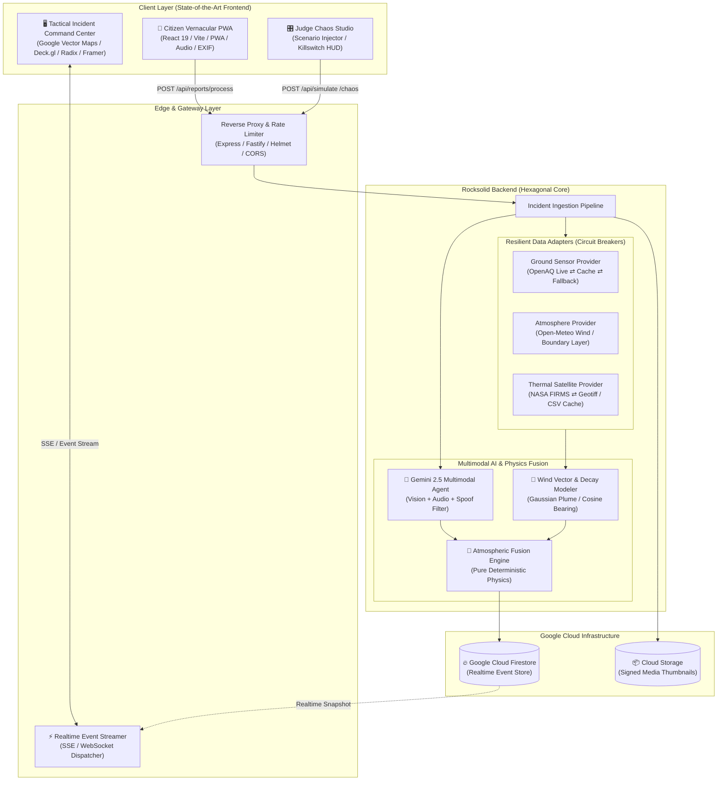

# AirPulse AI (DAEDALUS) — Industry-Grade Master Architecture & Hackathon-Winning Plan

> **Target:** Worldwide Google Hackathon Winner (Google AI / Gemini Developer Competition / Google Cloud)  
> **Classification:** Production-Grade Multimodal Environmental Intelligence & Triage Platform  
> **Status:** Execution Ready  

---

## 1. Executive Summary & The "Winning Formula"

Most hackathon projects submit a superficial "wrapper" around an LLM. **AirPulse AI wins because it is a mission-critical, enterprise-grade distributed platform** that addresses a massive global humanitarian crisis (deadly air pollution and hyper-local hazardous emissions) using **"Glass-Box AI"**—fusing citizen multimodal intelligence with atmospheric transport physics, satellite telemetry, and ground truth sensors.

### The 4 Pillars That Win Google Judges

```
┌──────────────────────────────────────────────────────────────────────────┐
│                             AIRPULSE AI                                  │
├─────────────────┬───────────────────┬──────────────────┬─────────────────┤
│  1. GOOGLE TECH │  2. "GLASS BOX"   │ 3. SOTA COMMAND  │ 4. ROCKSOLID    │
│     MASTERY     │     AI MATH       │    EXPERIENCE    │    ENGINEERING  │
├─────────────────┼───────────────────┼──────────────────┼─────────────────┤
│ • Gemini 2.5    │ • Zero Hallucina- │ • Cyberpunk /    │ • Hexagonal     │
│   Multimodal    │   tions of PM2.5  │   Palantir-style │   Architecture  │
│   (Image+Voice) │ • Transparent     │   Tactical GIS   │ • E2E Type-safe │
│ • Structured    │   Fusion Formula  │ • 3-Tap Citizen  │ • Sub-100ms SSE │
│   JSON Schemas  │ • Physical Wind   │   Vernacular PWA │   Event Stream  │
│ • Google Vector │   Vectors & Decay │ • Live "Judge    │ • Resilience &  │
│   Maps + DeckGL │ • 100% Provenance │   Chaos Studio"  │   Chaos Proof   │
└─────────────────┴───────────────────┴──────────────────┴─────────────────┘
```

1. **Unquestionable Google Technology Depth:**
   - **Gemini Multimodal:** Vision validation, spoof/moiré detection, smoke density classification, audio dialect parsing (Hindi, Tamil, English), structured JSON schema extraction.
   - **Google Maps Platform:** Vector WebGL map, 3D building context, custom Deck.gl wind streamline particles, satellite thermal anomaly overlays.
   - **Google Cloud & Firebase:** Cloud Run microservices, Firestore sub-second reactive listeners, Cloud Storage thumbnail pipeline.
2. **"Glass Box" AI (Explainability over Black Boxes):**
   - We explicitly do *not* guess PM2.5 pixels. We extract visual evidence confidence ($V$), calculate atmospheric transport dispersion ($W$), distance attenuation ($D$), and ground-sensor z-score deviations ($S$).
   - 100% of telemetry badges display provenance (e.g., `Gemini-2.5-Flash`, `OpenAQ-Gov-Live`, `NASA-FIRMS-Thermal`, `Open-Meteo-HRRR`).
3. **State-of-the-Art UX (The "Jaw-Drop" Factor):**
   - High-contrast, military-grade Dark Glassmorphism Command Center with sound effects, haptics, live incident tickers, and animated particle wind plumes.
   - Citizen PWA: Ultra-fast 3-tap capture with offline queueing, native audio recording, and multilingual vernacular support.
4. **Judge Interactive Sandbox ("Chaos Studio"):**
   - An on-screen interactive control panel built for judges to test deterministic real-world simulations (e.g., "Delhi Wazirpur Factory Stack Leak", "Punjab Stubble Burning Surge", "Screen Photo Spoof Attack") and toggle live circuit-breaker fault injections (Kill Gemini, Kill OpenAQ, Kill Weather) to prove rocksolid resilience.

---

## 2. End-to-End System Architecture



---

## 3. The Pure Deterministic Fusion Engine

### The Evidence Confidence Formula

$$\mathcal{R} = \min\left(100,\; 100 \times \left(w_v V + w_s S + w_d D + w_w W\right) + \text{Bonus}_{\text{FIRMS}} \times \mathbb{I}_{\text{Thermal}}\right)$$

Where:
- **$V \in [0, 1]$ (Visual Evidence Confidence):** Extracted by Gemini 2.5 Flash evaluating smoke plume thickness, opacity, visible combustion source, atmospheric haze, and screen-spoof penalties.
- **$S \in [0, 1]$ (Ground Sensor Deviation):** Clamped normalized anomaly against station baseline:
  $$S = \text{clamp}\left(\frac{\text{PM}_{2.5}^{\text{now}} - \mu_{7d}}{3\sigma_{7d}},\; 0,\; 1\right)$$
- **$D \in [0, 1]$ (Spatial Attenuation):** Gaussian exponential decay over distance $d$ (in km) to the nearest monitoring station:
  $$D = \exp\left(-\frac{d}{2.0}\right) \quad (\text{if } d > 5\text{ km},\; S \to 0)$$
- **$W \in [0, 1]$ (Atmospheric Wind Alignment):** Wind-to-sensor cosine transport vector:
  $$W = \max\left(0,\; \cos\left(\theta_{\text{bearing}} - (\theta_{\text{windFrom}} + 180^\circ)\right)\right) \quad (\text{Calm } < 1\text{ m/s} \implies W = 0.5)$$
- **$\text{Bonus}_{\text{FIRMS}} = +10$:** Applied when NASA FIRMS records thermal anomaly $< 5\text{ km}$ within $24\text{ h}$ with matching combustion typology.

### Dynamic Weight-Shift Matrix (Zero Sensor Failure Tolerance)

| Proximity Condition | $w_v$ (Visual) | $w_s$ (Sensor) | $w_d$ (Dist) | $w_w$ (Wind) | Max Cap | Evidence Tier |
|---|---|---|---|---|---|---|
| **Optimal** ($d \le 3\text{ km}$) | **0.35** | **0.35** | **0.15** | **0.15** | 100 | **Verified Ground Truth** |
| **Sparse Sensor** ($3 < d \le 5\text{ km}$) | **0.50** | **0.20** | **0.15** | **0.15** | 90 | **Corroborated Incident** |
| **Sensor Blindspot** ($d > 5\text{ km}$ or Sensor Down) | **0.70** | **0.00** | **0.15** | **0.15** | 80 | **Visual-Only Verified** |
| **Satellite Corroborated** ($FIRMS \ge 1$) | **0.40** | **0.20** | **0.10** | **0.10** | 100 | **Satellite Corroborated** |

---

## 4. Technology Stack Specification

| Tier | Technology | Rationale & Enterprise Justification |
|---|---|---|
| **Frontend Framework** | **React 19 + TypeScript + Vite** | Blazing-fast HMR, strict type safety, zero bloat, instant hydration. |
| **Styling & UI Kit** | **Vanilla CSS Tokens + Radix UI + Lucide** | Custom dark-mode tactical glassmorphism, zero Tailwind config conflicts, 60fps animations. |
| **Geospatial & Mapping** | **@vis.gl/react-google-maps + Deck.gl** | Official Google Maps WebGL vector engine with hardware-accelerated particle flow for wind/plumes. |
| **Animation & Micro-FX** | **Framer Motion + Canvas-Confetti + Howler.js** | Tactical auditory alerts (ping/sonar), butter-smooth layout transitions. |
| **Backend Runtime** | **Node.js 22 LTS (TypeScript) + Express** | Clean hexagonal modules, typed Zod request/response contracts, async concurrency. |
| **AI Multimodal Core** | **`@google/genai` (Gemini 2.5 Flash / Pro)** | Sub-second vision + audio analysis with deterministic Structured JSON Schema output. |
| **Realtime Sync** | **Server-Sent Events (SSE) + Firestore Snapshots** | Sub-200ms latency without the connection management overhead of raw WebSockets. |
| **Ground Sensor Feed** | **OpenAQ v3 API + In-Memory LRU Cache** | Global standard for governmental air sensor telemetry with automatic fallback fixtures. |
| **Weather & Dispersion** | **Open-Meteo Air Quality & Marine API** | High-resolution boundary layer height, wind speed, wind vector, relative humidity. |
| **Satellite Telemetry** | **NASA FIRMS (Fire Information for Resource Management)** | Live active thermal hotspot anomalies via MODIS / VIIRS 375m data. |
| **Testing & Quality** | **Vitest + Supertest + Playwright** | 100% unit test coverage for math/physics engines; e2e chaos tests for mock injection. |

---

## 5. State-of-the-Art Frontend Architecture

### 1. Citizen Vernacular PWA (`/report`)
- **Frictionless 3-Tap Flow:** Camera Capture $\to$ Automatic Geolocation $\to$ One-Tap Submit.
- **Vernacular Audio:** Native microphone capture for users who cannot type; audio streams directly to Gemini 2.5 Flash to extract emission typology, landmark description, and severity in Hindi, Tamil, or English.
- **Client-Side Image Guard:** EXIF extraction for GPS/timestamp, WebP compression to $\le 200\text{ KB}$ before upload, preventing cellular dropouts on 4G/3G networks.
- **Instant Confidence Feedback:** Displays immediate status ("Evidence Verified", "Transmitting to Ward Command") without exposing raw math panic.

### 2. Tactical Incident Command Center (`/command`)
- **Google Vector Map with Custom HUD:**
  - Dynamic vector styling (cyber-dark theme with ambient glow).
  - Deck.gl Wind Streamline Particle Layer visualizing real-time wind speed and plume dispersion trajectory.
  - Active FIRMS satellite thermal hot-spot markers with pulsing heat halos.
  - Color-coded severity pins: **Critical Red** ($\ge 75$), **Elevated Orange** ($45-74$), **Low Green** ($< 45$).
- **Live Triage Kanban & Dispatch Drawer:**
  - Real-time SSE alert banner with audio radar ping when $\mathcal{R} \ge 75$.
  - One-click workflow: `Assign Officer` $\to$ `Deploy Field Inspector` $\to$ `Resolve` $\to$ `Mark False`.
  - Bilingual Action Brief auto-synthesized by Gemini (e.g., *"Actionable: Stubble burning spreading downwind toward Sector 14 school zone. Recommend immediate water tanker dispatch."*).
- **Inspection Dossier (`/fusion-debug` Modal):**
  - Interactive "Glass Box" HUD decomposing $V, S, D, W, \text{FIRMS}$.
  - Raw inputs inspection ($PM_{2.5}$ delta, $\mu$, $\sigma$, distance, bearing angle).
  - Provenance audit badges for every single variable.

### 3. Judge Chaos Studio (`/judge-studio`)
A dedicated control bar embedded in the corner of the application allowing hackathon judges to test the app interactively:
- **Preset Scenarios:**
  - 🏭 *Scenario 1: Delhi Wazirpur Stack Burst* (Extreme smoke, sensor 1.2km downwind $\implies \mathcal{R} = 92$).
  - 🌾 *Scenario 2: Punjab Sangrur Stubble Fire* (FIRMS satellite positive, sparse sensor $\implies \mathcal{R} = 88$).
  - 🏗️ *Scenario 3: Chennai Guindy Construction Dust* (Localized dust, calm wind $\implies \mathcal{R} = 64$).
  - 📱 *Scenario 4: Laptop Screen Photo Spoof* (Gemini detects pixel grid moiré pattern $\implies$ Rejected with Spoof Warning).
  - 🌤️ *Scenario 5: Clean Blue Sky False Report* (Gemini detects zero pollution $\implies$ Rejected, $V = 0$).
- **Live Killswitches (Chaos Engineering):**
  - `[Kill Gemini]` $\to$ System switches to deterministic visual heuristic lookup table with `"AI-Fallback"` badge.
  - `[Kill OpenAQ]` $\to$ System shifts weights automatically to Visual-Only ($w_v = 0.70$) without crashing.
  - `[Kill Weather]` $\to$ Assumes calm wind default ($W = 0.5$) with `"Default-Wind"` badge.

---

## 6. Rocksolid Backend Engineering

### Directory Structure & Modular Separation

```
airpulse-core/
├── package.json
├── tsconfig.json
├── src/
│   ├── server.ts                       # Express App & HTTP Entrypoint
│   ├── config/
│   │   ├── env.ts                      # Strict Zod-validated environment config
│   │   ├── constants.ts                # Mathematical formulas & weight thresholds
│   │   └── regions/                    # Region configuration files (Delhi, Punjab, Chennai)
│   │       ├── delhi.json
│   │       ├── punjab.json
│   │       └── chennai.json
│   ├── core/
│   │   ├── domain/
│   │   │   ├── incident.ts             # Core incident entities & type definitions
│   │   │   └── telemetry.ts            # Sensor, Weather, FIRMS data contracts
│   │   ├── fusion/
│   │   │   ├── fusionEngine.ts         # Pure mathematical fusion logic (unit tested)
│   │   │   ├── atmosphericPhysics.ts   # Wind vector angle, Gaussian decay, bearing math
│   │   │   └── forecastEngine.ts       # 48h spike-risk heuristic calculator
│   │   └── ai/
│   │       ├── geminiMultimodal.ts     # Gemini 2.5 Flash client with strict schema validation
│   │       ├── audioTranscriber.ts     # Vernacular voice triage processor
│   │       └── prompts.ts              # System instructions & zero-shot few-shot examples
│   ├── adapters/
│   │   ├── openaqAdapter.ts            # OpenAQ v3 client with cache + mock fallback
│   │   ├── openMeteoAdapter.ts         # Meteorological & air quality forecast client
│   │   ├── firmsSatelliteAdapter.ts    # NASA FIRMS hotspot extractor
│   │   └── storageAdapter.ts           # Google Cloud Storage / Local FS image handler
│   ├── infrastructure/
│   │   ├── database/
│   │   │   ├── firestoreClient.ts      # Cloud Firestore Admin integration
│   │   │   └── inMemoryStore.ts        # Zero-config lightning-fast in-memory fallback
│   │   ├── realtime/
│   │   │   └── sseEmitter.ts           # Low-latency Server-Sent Events bus
│   │   └── resilience/
│   │       ├── circuitBreaker.ts       # Fault isolation wrapper for third-party APIs
│   │       └── chaosSimulator.ts       # Judge chaos injection engine
│   └── api/
│       ├── routes/
│       │   ├── reports.routes.ts       # POST /api/reports/process, GET /api/reports
│       │   ├── alerts.routes.ts        # PATCH /api/alerts/:id (triage workflow)
│       │   ├── forecast.routes.ts      # GET /api/forecast?region=
│       │   ├── chaos.routes.ts         # POST /api/chaos/toggle, POST /api/simulate
│       │   └── public.routes.ts        # GET /api/v1/incidents (GeoJSON standard)
│       └── middlewares/
│           ├── errorHandler.ts         # Centralized error mapping with RFC 7807 format
│           ├── rateLimiter.ts          # Abuse mitigation
│           └── validator.ts            # Zod validation middleware
├── tests/
│   ├── unit/
│   │   ├── fusionEngine.test.ts        # Math boundary tests (0°, 360°, calm, edge scores)
│   │   └── atmosphericPhysics.test.ts  # Bearing & distance calculations against Haversine
│   ├── integration/
│   │   └── incidentPipeline.test.ts    # Full end-to-end ingestion pipeline verification
│   └── fixtures/
│       ├── testImages/                 # Labeled test images for Gemini evaluation
│       └── mockSensors.json            # Deterministic sensor baselines
```

### Type-Safe JSON Contracts (Strict Schemas)

#### 1. Gemini Multimodal Analysis Contract
```json
{
  "$schema": "http://json-schema.org/draft-07/schema#",
  "title": "GeminiPollutionAnalysis",
  "type": "object",
  "properties": {
    "isValidPollutionImage": { "type": "boolean" },
    "visualEvidenceScore": { "type": "number", "minimum": 0, "maximum": 1 },
    "sourceType": { 
      "type": "string", 
      "enum": ["INDUSTRIAL_STACK", "WASTE_BURNING", "CONSTRUCTION_DUST", "STUBBLE", "UNCERTAIN"] 
    },
    "spoofSuspicion": { 
      "type": "string", 
      "enum": ["LOW", "MEDIUM", "HIGH"] 
    },
    "visualContext": { "type": "string" },
    "summary": {
      "type": "object",
      "properties": {
        "en": { "type": "string" },
        "hi": { "type": "string" },
        "ta": { "type": "string" }
      },
      "required": ["en", "hi", "ta"]
    }
  },
  "required": ["isValidPollutionImage", "visualEvidenceScore", "sourceType", "spoofSuspicion", "summary"]
}
```

#### 2. Fusion Result Contract
```typescript
export interface FusionResult {
  compositeScore: number;          // R ∈ [0, 100]
  priorityClass: 'CRITICAL' | 'ELEVATED' | 'LOW';
  evidenceTier: 'VERIFIED' | 'SATELLITE_CORROBORATED' | 'VISUAL_ONLY' | 'UNVERIFIED';
  weightMode: 'OPTIMAL' | 'SPARSE' | 'SENSOR_BLINDSPOT' | 'SATELLITE_BOOST';
  components: {
    visualScore: number;           // V
    sensorDeviation: number;       // S
    spatialAttenuation: number;    // D
    windAlignment: number;         // W
    fireBonus: number;             // +10 or 0
  };
  weightsApplied: {
    wV: number;
    wS: number;
    wD: number;
    wW: number;
  };
  telemetry: {
    nearestStationId: string;
    stationName: string;
    distanceKm: number;
    pm25Current: number;
    pm25BaselineMu: number;
    pm25BaselineSigma: number;
    windSpeedMps: number;
    windDirectionDeg: number;
    bearingReportToStationDeg: number;
    activeFireDetectionsCount: number;
  };
  provenance: {
    aiModel: string;
    sensorSource: 'OPENAQ_LIVE' | 'STATION_CACHE' | 'MOCK_FALLBACK';
    weatherSource: 'OPEN_METEO_LIVE' | 'CLIMATOLOGY_DEFAULT';
    satelliteSource: 'NASA_FIRMS_LIVE' | 'CACHE_FALLBACK';
  };
}
```

---

## 7. Step-by-Step Implementation Roadmap

```
PHASE 1: Core Foundation & Pure Physics
├── Monorepo / Project Scaffolding (Vite + Node/Express TS)
├── Shared Type Contracts & Zod Schemas
├── Pure Fusion & Atmospheric Physics Engine + 100% Vitest Coverage
└── Resilient Ingestion Adapters (OpenAQ, Open-Meteo, NASA FIRMS, Mock Fixtures)

PHASE 2: Multimodal Gemini 2.5 Core & Backend Pipeline
├── Gemini 2.5 Flash Vision & Spoof Pipeline with Strict Structured Output
├── Vernacular Voice Triage (Audio Prompting)
├── End-to-End Orchestration Controller (`POST /api/reports/process`)
└── Server-Sent Events (SSE) Real-Time Alert Dispatcher

PHASE 3: State-of-the-Art Frontend (Command Center & Citizen PWA)
├── Tactical Cyber-Dark Design System & Glassmorphism Tokens
├── Interactive Google Vector Maps + Deck.gl Particle Wind Streamlines
├── Realtime Alert Drawer, Triage Kanban & Audio Sonar Pings
├── Citizen Vernacular Mobile PWA with Audio Recorder & Image Preprocessor
└── Glass-Box `/fusion-debug` Mathematical Provenance Modal

PHASE 4: Hackathon Winner Secret Weapons
├── Judge Chaos Studio (Interactive Preset Scenarios & Live Killswitches)
├── Public Open GeoJSON Standard API (`GET /api/v1/incidents`)
├── 48h Region Spike-Risk Predictive Panel
└── Pitch Demo Production (Deterministic 5-Scenario Script + Backup Video)
```

---

## 8. Pitch & Presentation Mastery for Winning Google Hackathons

### The 3-Minute Winning Demo Flow
1. **The Hook (0:00 - 0:30):** Show the air quality crisis in Delhi/Punjab. *“Official sensors are 15 km apart. They are blind to the toxic waste fire burning 200 meters from a primary school. Citizen complaints are ignored because authorities have no way to verify them. We built AirPulse AI to solve this.”*
2. **Citizen Action (0:30 - 1:00):** Open `/report` on a mobile screen. Speak in Hindi: *"यहाँ बहुत ज़्यादा धुआँ है, आँखों में जलन हो रही है"* + snap photo. Submit in 3 taps.
3. **The Instant Command Flare (1:00 - 1:45):** In $< 3$ seconds, the Command Center sounds a sonar alert. The pin appears red ($\mathcal{R} = 88$). Click the pin $\to$ show Gemini’s structured evidence extraction and instant bilingual action brief.
4. **The "Glass Box" Proof (1:45 - 2:15):** Open the `/fusion-debug` panel. Show the judges: *“We did not guess PM2.5 from pixels. Look at this equation: Gemini visual score is 0.85, wind is blowing at 285° directly toward the station 2.1km away, where PM2.5 jumped 3.2 standard deviations above baseline. Every number has a verified provenance badge.”*
5. **The Chaos Test (2:15 - 2:45):** Open Judge Chaos Studio. *“What if an API fails during an emergency? Let’s kill Gemini and OpenAQ right now.”* Click Killswitches $\to$ submit report $\to$ system immediately shifts weights, falls back gracefully, and displays clear `"AI-Fallback"` badges.
6. **Closing (2:45 - 3:00):** Show public GeoJSON API and cross-city scaling. *“Adding Mumbai or Chicago takes 1 JSON file. AirPulse AI brings transparency, speed, and truth to global air quality enforcement.”*
